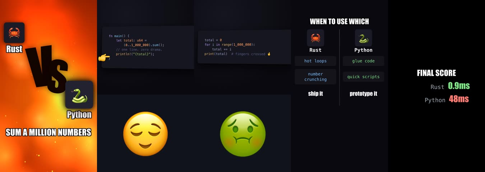

# videoeditor

Scripted short-video renderer for developers who'd rather write markdown than
open DaVinci. `script.md` in → rendered vertical video out.


*The bundled `examples/hello-bench` episode — five scenes rendered entirely
from markdown + SVG placeholders. This strip is actual output.*

- **Rust** orchestrates everything (`videoeditor`, one binary).
- **Web tech** does the animation: scenes are HTML templates rendered
  frame-by-frame by headless Chrome as pure functions of `(data, t)`.
- **ffmpeg** does the heavy lifting; **local speech models** voice the
  narration and transcribe (piper + whisper.cpp, no API key), with
  ElevenLabs as an opt-in upgrade.
- **Built to be driven by [Claude Code](https://claude.com/claude-code)** —
  scaffolds wire the session up automatically.

## Index

- [Install](#install)
- [Your first video](#your-first-video)
- [Let Claude direct](#let-claude-direct)
- [How it works](#how-it-works)
- [Templates](#templates)
- [Going deeper](#going-deeper)

## Install

With [nix](https://install.determinate.systems) (preferred — pins the binary,
ffmpeg, the render browser, and the local speech stack (whisper.cpp STT +
a piper voice) from the committed lockfile; details and every run variant
in [docs/nix.md](docs/nix.md)):

```bash
curl -fsSL https://install.determinate.systems/nix | sh -s -- install   # once
nix profile install github:security-union/videoeditor
```

Without nix: `cargo install videoeditor`, then bring ffmpeg
(`brew/apt/dnf install ffmpeg`) and Chrome (system install is auto-detected;
`CHROME_BIN` overrides). macOS and Linux; on Windows use WSL.

Everything runs keyless by default: narration uses a bundled local piper
voice, transcription uses bundled whisper.cpp. Prefer ElevenLabs voices?
Set `tts: elevenlabs` in the script frontmatter with an `ELEVENLABS_API_KEY`
([elevenlabs.io](https://elevenlabs.io) → profile → API keys; free tier is
plenty). Non-nix installs bring their own whisper.cpp/sherpa-onnx for the
local stack (see `videoeditor guide`, Env section).

## Your first video

```bash
videoeditor new my-first-short     # runnable scaffold, placeholder assets included
cd my-first-short && claude        # then type /direct
```

No Claude? The manual loop: edit `script.md`, then
`videoeditor build .` (tts → render → assemble) and open `build/final.mp4`.
Iterate one piece at a time: `tts . --clip name --force` re-rolls one voice
take, `render . --scene name` re-renders one scene, `assemble .` re-mixes in
seconds. `videoeditor guide` prints the full rulebook.

## Let Claude direct

The tool wires Claude Code up by itself: every scaffold carries a `CLAUDE.md`,
`videoeditor -h` points agents at the embedded rulebook (`videoeditor guide`),
and `/direct` — dropped into every episode — runs the wizard: it interviews
you (format, topic, real data for the receipts, tone, assets, voice), then
drives script → voice → render → final.mp4 with approval checkpoints before
anything costs money. Or skip the wizard and ask in your own words:

> "Make a 25-second short: Rust vs Go parsing a 1GB JSON file. Run a real
> benchmark first, then script it, voice it, render it, and QA the frames."

## How it works

```
script.md ──parse──► timeline plan
   │
   ├─ videoeditor tts       [CLIP:] → piper (or ElevenLabs) → audio/clips/ + audio/clips.json
   ├─ videoeditor render    [SCENE:] → Chrome frames → ffmpeg → build/scenes/
   └─ videoeditor assemble  concat + narration@offsets + music → build/final.mp4
```

A scene names a template and a duration; `[DATA:]` feeds the template;
`[CLIP:]` blocks carry narration placed at exact offsets. The engine warns
when narration overlaps (fit-check) or a template clips its content — and
the whole render is deterministic: same inputs, same pixels.

It's a five-crate Rust workspace, ffmpeg-style (thin CLI over focused
libraries) — the crate map lives in [CLAUDE.md](CLAUDE.md).

## Templates

Browse the repertoire: `videoeditor templates` lists every scene template
with its data keys; `videoeditor preview` renders each one's demo into a
contact-sheet PNG so you can see the motion before using it.

Your look doesn't live in the engine: each episode can carry its own
templates, and shared **packs** carry a channel's identity across videos —
layered resolution, most specific wins. `videoeditor pack init` scaffolds
one, including the authoring contract Claude follows (compose the proven
animation blocks in `_lib/scene.js`; never hand-roll curves). Full guide:
[docs/templates.md](docs/templates.md).

## Going deeper

| Where | What |
|---|---|
| `videoeditor guide` | the embedded rulebook: grammar, director loop, craft rules |
| [docs/templates.md](docs/templates.md) | organizing templates: per-video, packs, machine-wide |
| [docs/nix.md](docs/nix.md) | deterministic installs, dev shell, releases |
| [CLAUDE.md](CLAUDE.md) | contributor + agent operations: crate map, commands, invariants |
| [examples/hello-bench](examples/hello-bench) | the end-to-end example episode |

MIT licensed. Syntax highlighting via [highlight.js](https://highlightjs.org)
(BSD-3-Clause, vendored).
